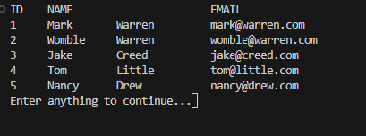

# PyLite Customers

## Description

The PyLite Customers Project is a short simple Python Program which allows you to view, edit and delete rows from a basic database using sqllite. 
This shall also recreate the data in order to show that not only is the data easy to store, but also maintain if something went wrong.

Note: Your data will be stored locally and is overwritten after each launch of the program. The program may need to be ran twice in order to execute properly.

## Sources

Code was adapted from the tutorial provided by freeCodeCamp.org (credit to John Elder): 

https://www.youtube.com/watch?v=byHcYRpMgI4

Their referred url link to their github:

https://github.com/flatplanet/Intro-To-TKinter-Youtube-Course

A handy piece of code for clearing the screen provided by Grepper (credit to Expensive Eagle): 

https://www.codegrepper.com/code-examples/python/python+os.system+clear+screen

Comments include these sources within.

### Features:
- Displays Database Records
- Creates default customer data for use in the program
- Allows User to add own Record
- Allows User to delete a Record (By ID only)
- Search Feature
  - By ID
  - By First Name
  - By Last Name
  - By Email
- Allows User to ammend a Record
  - By First Name
  - By Last Name
  - By Email
- Allows User to Reset the Database
- Exits the Program

[Back to Top](#SQLLitePyProject)
